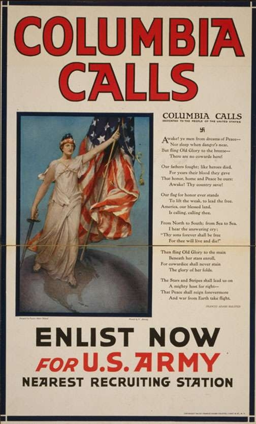

# Propaganda plakátok

A plakátok mint grafikai műfaj, igencsak nagy erővel bír a kortárs tömegkomunikáció korszakában. A köztereket teljesen meghatározó szerepét a technológiai fejlődéssel együtt viszont fokozatosan veszítik el, mégis a mai napig fel-fel kelti érdeklődésünket egy-egy izgalmasabb grafikai megoldás, esetlegesen egy jól megfogalmazott szlogen segítségével.

A történelem során a plakátok voltak az egyik első médium, amelyet a propagandisztikus tömegmanipuláció eszközeként kezdtek el használni. Most a korai propaganda plakátok közül fogunk egy számomra kedves, érdekes vagy csak meghökkentő listát alkotni, amelyen keresztül megismerhetjük eme csodálatos médium kevésbé csodálatos felhasználási módszerét, valamint jobban szemügyre tudjuk venni, hogy hogyan is alakul ki a hegemón narratíva.
___

## I. Világháború propaganda plakátjai

### Columbia calls


> Tervezte: **Frances Adams Halsted**<br>Festette: **Vincent Aderente**<br>Kiadás éve: **1916**<br><br> Kép forrássa: [*Libary of Congress*/Az USA kongreszusi könyvtára](https://www.loc.gov/resource/ppmsca.50012)

Számomra a ***Columbia calls*** nem csak azért rendkívül érdekes, mert egy női alakott ábrázol, vagy még csak nem is a szvasztika, amely elbújik a képen, hanem a szvasztika alatt megtalálható vers.

A verset, ugyanis a plakát tervezője **Frances Adams Halsted** írta. A vers így hangzik: 

```
Awake! ye men from dreams of Peace--
	Nor sleep when danger's near,
But fling Old Glory to the breeze--
	There are no cowards here.

Our fathers fought; like heroes died,
	For years their blood they gave
That honor, home and Peace be ours;
	Awake! Thy country save!

Our flag for honor ever stand
	To lift the weak, to lead the free.
America, our blessed land,
	Is calling, calling thee.

From North to South: From Sea to Sea,
	I hear the answearing cry:
"Thy sons forever shall be free
	For thee will live and die"

Then fling Old Glory to the main
	Beneath her stars enroll,
For cowardice shall never stain
	The glory of her folds.

The Stars and Stripes shall lead us on
	A mighty host for right--
That Peace shall reign forevermore
	And war from Earth take flight.
```

A plakátnak mindezek mellet létezett egy másik variánsa, ahol ugyanezek a szövegek láthatóak, más eloszlásban, valamint a festmény nem a plakát teljességét fedi el, hanem csak egy külön képként jelenik meg.



### Invest your money with Uncle Sam!


> Tervezte: **Ismeretlen**<br>Rajzolta: **Ismeretlen**<br>Kiadás éve: **1917**<br><br> Kép forrássa: [*Libary of Congress*/Az USA kongreszusi könyvtára](https://www.loc.gov/resource/cph.3g08123/)

Egy számomra meglehetősen érdekes plakáttal szeretném folytatni a sort, hiszen a háború gazdasági értelemben vett hátország szrepét 