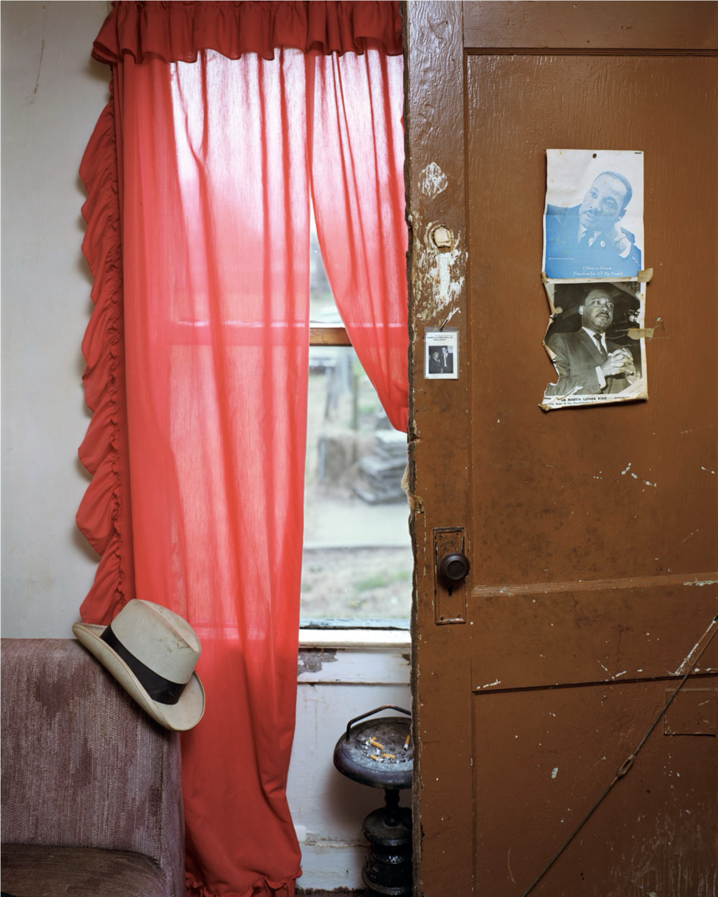

# Álló képek

## Szimmetrikus

### Filmek

Alfred Hitchcock - Psycho (1960)

Fritz Lang - Metropolis (1927)

Orson Welles - Citizen Kane (1941)

 

### Fotók

[Linus (művésznév)](https://www.instagram.com/linusandhiscamera/) - the twins (2024)

[Kwei Shun-Yu 桂順禹](https://www.instagram.com/kwei_shunyu/?g=5) - *Cím nélküli* (2023)

[Alec Soth](https://alecsoth.com/) - [Sleeping by the Mississippi](https://alecsoth.com/photography/projects/sleeping-by-the-mississippi) (fotókönyv) - Luxora (2002) 

 

## Asszimetrikus

### Filmek

Alfred Hitchcock - Psycho (1960)

Fritz Lang - Metropolis (1927)

Orson Welles - Citizen Kane (1941)

 

### Fotók

[Alec Soth](https://alecsoth.com/) - [Sleeping by the Mississippi](https://alecsoth.com/photography/projects/sleeping-by-the-mississippi) (fotókönyv) - Peter's Houseboat (2002)

[Joshua K. Jackson](https://www.joshkjack.com) - *Cím nélküli* (2017)

[Tod Hido](http://www.toddhido.com) - [Homes at Night](http://www.toddhido.com/homes) (Fotó sorozat) - #1941 (*ismeretlen dátum*)

 

## Háromszög

### Film

Alfred Hitchcock - Psycho (1960)

Fritz Lang - Metropolis (1927)

Orson Welles - Citizen Kane (1941)

 

### Fotó

[Alec Soth](https://alecsoth.com/) - [Sleeping by the Mississippi](https://alecsoth.com/photography/projects/sleeping-by-the-mississippi) (fotókönyv) - Cemetery (2002)

[Jason Kummerfeldt](http://www.jasonkummerfeldt.com) - [Life House Hotel (Palm Springs)](http://www.jasonkummerfeldt.com/life-house-palm-springs-2024) (fotó sorozat) - *Cím nélküli* (2024)

[Dragon Tamás](https://tamasdragon.photography) - *Cím nélküli* (2024)

 

## Vízszintes

### Film

Alfred Hitchcock - Psycho (1960)

Fritz Lang - Metropolis (1927)

Orson Welles - Citizen Kane (1941)

 

### Fotó

[Alec Soth](https://alecsoth.com/) - [Sleeping by the Mississippi](https://alecsoth.com/photography/projects/sleeping-by-the-mississippi) (fotókönyv) - Johnny Cash's Boyhood Home (2002)

[Dragon Tamás](https://tamasdragon.photography) - *Cím nélküli* (2024)

[Tod Hido](http://www.toddhido.com) - [Homes at Night](http://www.toddhido.com/homes) (Fotó sorozat) - #3002 (*ismeretlen dátum*)

 

## Függőleges

### Film

Alfred Hitchcock - Psycho (1960)

Fritz Lang - Metropolis (1927)

Orson Welles - Citizen Kane (1941)

 

### Fotó

[Alec Soth](https://alecsoth.com/) - [Sleeping by the Mississippi](https://alecsoth.com/photography/projects/sleeping-by-the-mississippi) (fotókönyv)- Jimmie's Apartment (2002)

[Ruff Draft](http://www.ruffdraftvisuals.com) - *Cím nélküli* (2023)

 

[Alan Schaller](http://alanschaller.com) - *Cím nélküli* (*ismeretlen év*)

 

## Átlós

### Film

Alfred Hitchcock - Psycho (1960)

Fritz Lang - Metropolis (1927)

Orson Welles - Citizen Kane (1941)

 

### Fotó

[Tod Hido](http://www.toddhido.com) - [Homes at Night](http://www.toddhido.com/homes) (Fotó sorozat) - #4022 (*ismeretlen év*)

[Joshua K. Jackson](https://www.joshkjack.com) - *Cím nélküli* (*ismeretlen dátum*)

[Szilveszter Makó](https://www.instagram.com/szilvesztermako/) - *Cím nélnüli* (2023)